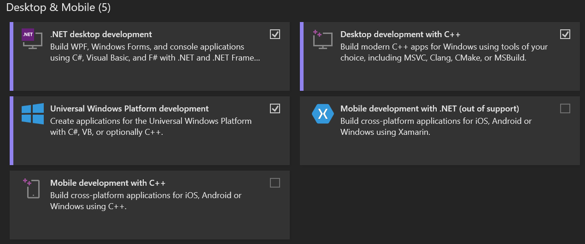
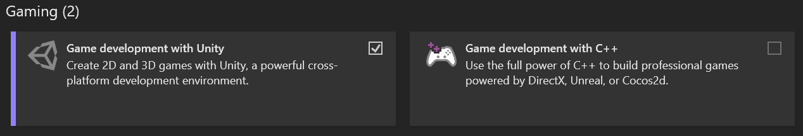
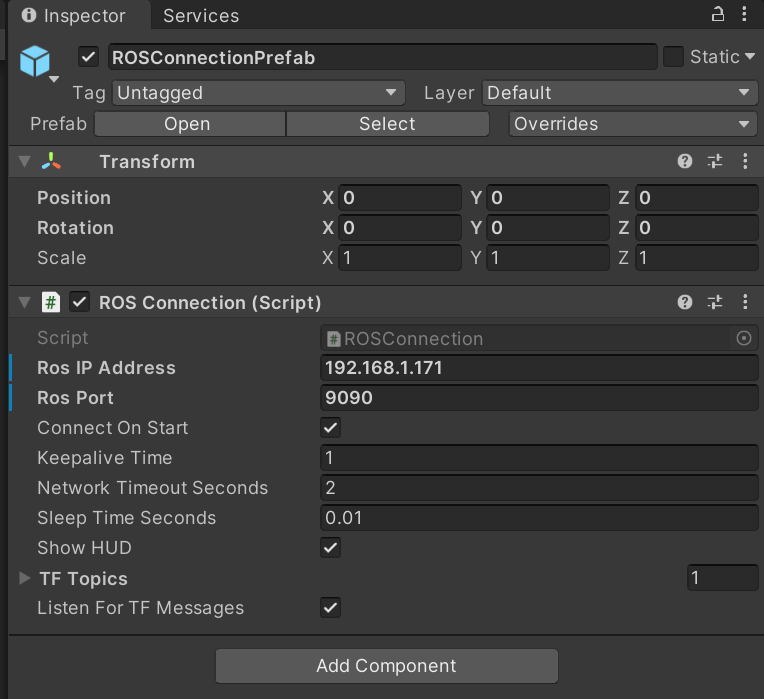

# LiMRSF (LiDAR-MR-RGB Sensor Fusion)

  
  

## Abstract
**Authors**: `Hanbeom Chang` | `Jongseong Brad Choi` | `Chul Min Yeum`\
Indoor SLAM often suffers from issues such as scene drifting, double walls, and blind spots, particularly in confined spaces with objects close to the sensors (e.g., LiDAR and cameras) in reconstruction tasks. While real-time visualization of point cloud registration during data collection can mitigate these issues, conventional approaches lack the capability for in-depth, on-site comparison between the reconstructed data and the physical environment, often necessitating repeated rescans. To address this, we developed the LiMRSF (LiDAR-MR-RGB Sensor Fusion) system, which integrates precise sensor fusion with mixed-reality visualization to provide immediate, intuitive feedback. The system generates accurate colorized point cloud maps and reconstructs detailed 3D meshes using Poisson Surface Reconstruction, automatically highlighting under-sampled (blind spot) regions. These holographic representations are transmitted via a TCP-based network to an MR headset, enabling users to verify and correct errors in real time. In addition, an iterative feedback loop—augmented by an ICP-based alignment process that integrates newly scanned data with previous acquisitions—reinforces the dataset, substantially reducing blind spot prevalence. Experimental results demonstrate robust performance with an F1 Score of 75.76%, high Recall, and enhanced structural fidelity (with the highest SSIM of 0.5619, PSNR of 14.1004, and lowest MSE of 0.0389 in selected model sections). This comprehensive approach ensures the creation of high-quality 3D datasets for applications in Building Information Modeling and beyond.

The paper can be found in [Arxiv](https://arxiv.org/abs/2411.12514).

A demo video can be found on our [YouTube](https://youtu.be/lripMy5RFcs?si=86RJgNUZksLTAuX1)

An explanatory video presentation can be found on our [YouTube](https://youtu.be/3EbnmCrZffk?si=n-qdLW7e8psmeuPf) 

## Table of Contents

1. [Description](#description)  
2. [Features](#features)  
3. [Prerequisites & Installation](#prerequisites)  
4. [Validation With Our Data](#validation-with-our-data)
5. [Contributing](#contributing)  
6. [License](#license)  
7. [Contact](#contact)

## 1. Description
Our `LiMRSF` (LiDAR-MR-RGB Sensor Fusion) system overlaps a 3D point cloud or 3D mesh on top of a Mixed Reality Headset (HoloLens 2) in real-time to detect blind spots in the SLAM process and feedback intuitively to the user.

`Main objective` is to
- Point cloud registration error visualization
- ROS-TCP Server for data transfer
- Reduce time for site revisit with Human-in-the-Loop

## 2. Features
Unity scene for MR headset (HoloLens 2) to visualize transmitted mesh (`.ply`) with detected blind spots.
- **ROS**: Opens ROS-TCP server and transfers data (blind spot highlighted mesh)
- **Unity**: Deployed in the app for visualizing the highlighted mesh in holograms

## 3. Prerequisites & Installation

### **3.1. Hardware**

`MR Headset`: Microsoft HoloLens 2  
`LiDAR`: Ouster OS0-32  
`IMU`: Built-in LiDAR in Ouster LiDAR  
`Camera`: FLIR Blackfly S

### **3.2. Software** 

**OS #1**: `Ubuntu 20.04`, ROS 1 `Noetic`  
**Drivers**: [Ouster Driver, Official](https://github.com/ouster-lidar/ouster-ros), [FLIR Driver, ros-drivers](https://github.com/ros-drivers/flir_camera_driver/tree/noetic-devel)  
**Calibration**: [LiDAR-Camera Calibration, Koide3](https://github.com/koide3/direct_visual_lidar_calibration)  
**Color Mapping**: [R3LIVE, hku-mars](https://github.com/hku-mars/r3live)  

**OS #2**: `Windows 10`  
`Download #1`: **Visual Studio 2019**  
Select `.NET desktop development`, `Desktop development with C++`, `Universal Windows Platform development`, `Game development with Unity`.

`Download #2`: **Unity Hub & Unity Editor**  
[Unity Hub Download](https://unity.com/download)  
[Unity Editor Download](https://unity.com/releases/editor/archive)  
We have tested our system with `Unity Editor 2020.3.42f1`

### 3.2.1 **ROS: ROS-TCP-Endpoint**  
This tool is for connecting ROS and Unity through TCP network in `ROS`.  
`git clone https://github.com/Unity-Technologies/ROS-TCP-Endpoint.git`

### 3.2.2 **Unity: ROS-TCP-Connector**: 
This tool is for connecting ROS and Unity through TCP network in `Unity`.  
Follow Installation Guide [Link](https://github.com/Unity-Technologies/ROS-TCP-Connector)

### 3.2.3 Install MRTK 2 in the Unity Scene
[Microsoft MRKT2 Guide](https://learn.microsoft.com/en-us/windows/mixed-reality/mrtk-unity/mrtk2/packages/mrtk-packages?view=mrtkunity-2022-05)

### **3.3 Configuration**

### 3.3.1 Clone the entire repository  
`git clone https://github.com/hbj9807/LiMRSF.git`

### 3.3.2 ROS Settings
`ROS_files` folder goes to your ROS system, and run with ROS-TCP-Endpoint.  

### 3.3.3 ROS-Unity TCP Settings
After installing `Unity` in `Windows platform`, in `ROSConnectionPrefab`, set `ROS IP Address` and `ROS Port` to the settings of your own `ROS-TCP-Endpoint's` IP and Port.  

## Validation With Our Data
1. Download our `Google Drive Dataset`: [https://drive.google.com/drive/u/1/folders/1et2u-7XFjwj3Bzm7ewrv6NoXhvH_1SC1](https://drive.google.com/drive/folders/1C-asrQ4nQnr937TkHoksUBUz2xdc7tX8?usp=sharing)
All the evaluated data (.csv) are in the `Evaluation` folder.

3. Run `LiMRSF.py` in your ROS machine to generate `Mesh with Highlighted Result` and `Visualization in HoloLens 2`.
Confirm that your HoloLens 2 and ROS-TCP-Endpoint are connected with the same IP address.

4. Run `blindspot_eval_test.py` in any machine (ROS, Windows) to evaluate the blind spot detection precision.

5. Run `similarity_eval.py` in any machine (ROS, Windows) to evaluate the similarity between `Highlighted Mesh` and `Simplified Mesh`.

## Contributing
This work was supported by the National Research Foundation of Korea (NRF) grant funded by the Korea government (MSIT) (Grant No. 2022M1A3C2085237). 

## License
This project is licensed under the MIT License – see the [LICENSE](./LICENSE.md) file for details.

## Contact
Hanbeom Chang - hanbeom.chang@stonybrook.edu  
MEIC Lab. - https://www.meic-lab.com/
